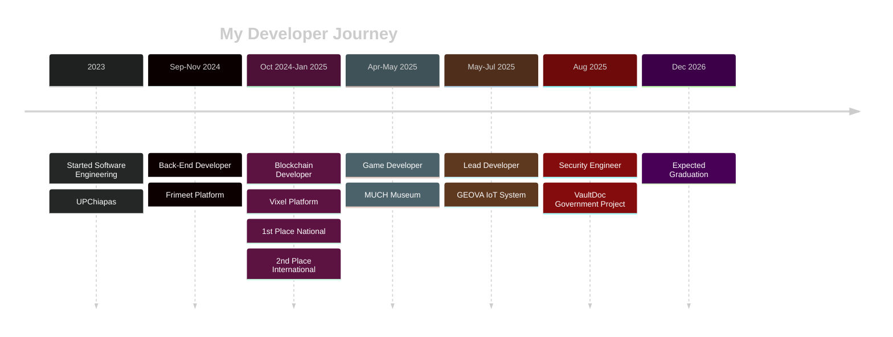

<br clear="both">

<p align="center">
  
</p>

<h1 align="center">
  
</h1>

<p align="center">
  
  
  
  
</p>

<p align="center">
  <b>🏆 1st Place National Hackathon | 🥈 2nd Place International MegaHackathon Vara</b>
</p>

---

### Connect with me

<p align="center">
  <a href="https://www.linkedin.com/in/jos%C3%A9-antonio-pinto-aguilar-b884b92a2">
    
  </a>
  <a href="https://github.com/JosephAntony37900">
    
  </a>
  <a href="https://josephantony37900.github.io/Portafolio-V2/">
    
  </a>
  <a href="mailto:JoseAntonioPintoAguilar@gmail.com">
    
  </a>
  <a href="https://x.com/VixelTorn">
    
  </a>
</p>

---

<table>
  <tr>
    <td>

### About Me

```yaml
name: José Antonio Pinto Aguilar
location: Tuxtla Gutiérrez, Chiapas 🇲🇽
education: Software Engineering @ UPChiapas
graduation: December 2026
role: Backend Developer & DevOps Engineer

focus:
  - Building robust backend systems
  - Ethical hacking & penetration testing
  - Cloud infrastructure (AWS)
  - Blockchain development (Vara Network)
  - IoT integration (Raspberry Pi & ESP32)

achievements:
  - 1st Place National Hackathon (Chiapas)
  - 2nd Place MegaHackathon Vara CDMX
  - AWS Academy Graduate (3 certifications)
  - Government Project Security Engineer
```

### Current Projects

-  **Vixel** - Decentralized gaming platform on Vara Blockchain
-  **GEOVA** - IoT measurement system for civil engineering
-  **VaultDoc** - Secure document management with pentesting
-  **Frimeet** - Recommendation platform with ML

</td>
<td align="center">
  
  <br><br>
  
</td>
  </tr>
</table>

---


### Tech Stack

#### Backend


#### Frameworks & Tools


<br clear="both">

---

### Databases & ORMs

<p align="center">
  
  
  
  
  
  
</p>

<p align="center">
  
  
  
</p>

---

### DevOps & Cloud

<p align="center">
  
  
  
  
  
  
  
  
</p>

---

### Security & Hacking Tools

<p align="center">
  
  
  
  
  
  
</p>

<p align="center">
  
  
  
  
  
  
</p>

---

### Blockchain & Web3

<p align="center">
  
  
  
  
</p>

---

### Systems & Embedded

<p align="center">
  
  
  
  
  
</p>

---

### Architectures & Patterns

<p align="center">
  <b> Clean Architecture</b> • <b> Hexagonal Architecture</b> • <b> Event-Driven</b> • <b> SOLID</b> • <b> Design Patterns</b> • <b> Concurrency Patterns</b>
</p>

---

<p align="center">━━━━━━━━━━━━━━━━━━━━━━━━━━━━━━━━━━━━━━━━━━━━━━━━━━━━━━━━━━━━━━━━━━━━━━━━━━━━━━━━━━━━━━</p>

<div align="center">

## GitHub Stats


</div>

<div align="center">
  
  
</div>

<br/>

<div align="center">
  
</div>

---

### Achievements & Certifications

<p align="center">
  
  
</p>

<table align="center">
  <tr>
    <td align="center">
      <br>
      <br>
      
    </td>
    <td align="center">
      <br>
      <br>
      
    </td>
    <td align="center">
      <br>
      <br>
      
    </td>
  </tr>
</table>

---

### Featured Projects

<div align="center">

| Project | Description | Tech Stack | Achievement |
|-----------|---------------|---------------|----------------|
| **Vixel** | Decentralized gaming, tournaments & streaming platform | Vara Blockchain, Web3, Go, React | 🥇 1st National / 🥈 2nd International |
| **GEOVA** | IoT measurement system for civil engineering | Python, Raspberry Pi, ESP32, FastAPI | Lead Developer |
| **VaultDoc-VD** | Secure document management for government | Go, JWT, PostgreSQL, Hexagonal Arch | Security Engineer |
| **Frimeet** | AI-powered recommendation platform | Python, MongoDB, PostgreSQL, REST APIs | Backend Lead |
| **Educational Game 2D** | Human body formation game for MUCH museum | Game Dev, Clean Architecture | Backend Developer |

</div>

---

### Professional Experience Timeline



---

### Contribution Snake

<div align="center">
  


</div>

---

<p align="center">
  
</p>

<div align="center">

### Random Dev Quote


---


**⭐️ From [JosephAntony37900](https://github.com/JosephAntony37900)**

*"First, solve the problem. Then, write the code."* – John Johnson

</div>
